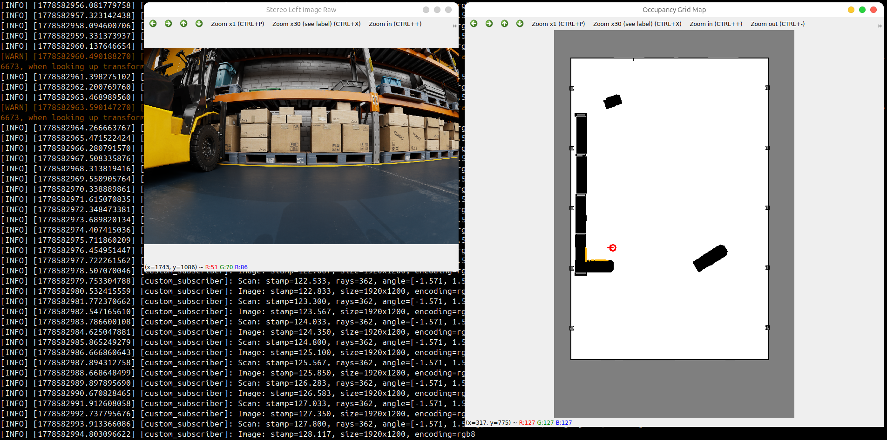

# ros-pkg-boilerplate

```shell
cd /jazzy_ws

source /opt/ros/jazzy/setup.sh
colcon build

source install/local_setup.bash
export ROS_DOMAIN_ID=0
export FASTRTPS_DEFAULT_PROFILES_FILE=/jazzy_ws/fastdds.xml

ros2 run ros-pkg-boilerplate custom_subscriber
```

